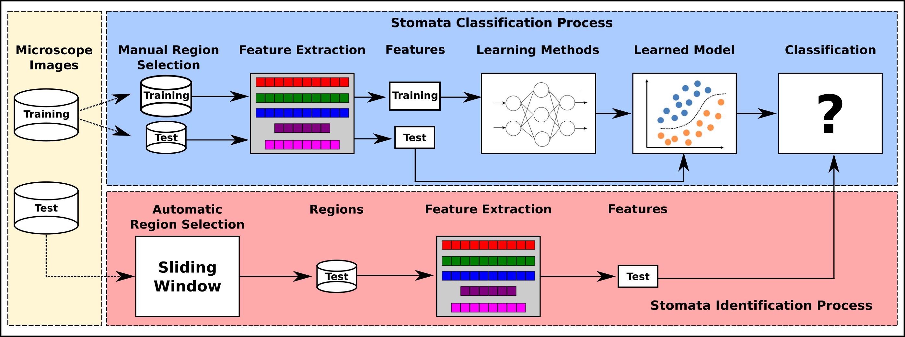

##     Automated Stomata Classification and Detection in Microscope Images of Maize Cultivars

Alexandre Aono$^{1}$, James Nagai$^{1}$, Gabriella Dickel$^{2}$, Paulo Oliveira$^{2}$, Joao Paulo Papa$^{3}$, Fabio Augusto Faria$^{1}$*

*$^{1}$ Instituto de Ciência e Tecnologia, Universidade Federal de São Paulo -  UNIFESP - 12247-014, São José dos Campos, SP-Brazil*

*$^{2}$* Instituto *de Biologia, Universidade Federal de Uberlandia, Uberlandia, MG-Brazil*

*$^{3}$* *Universidade Estadual de São Paulo - UNESP, Bauru, SP- Brazil*

### Abstract

        Research on stomata, i.e., morphological structures of plants, has increased in popularity in the last years. These structures (pores) are in charge of the interaction between the internal plant system and the environment, working on different processes such as photosynthesis and transpiration stream. Besides, a better understanding of the pore mechanism plays a significant role when exploring the evolution process, as well as the behavior of plants. Although the study of stomata in dicots species of plants has advanced considerably in the past years, there is little information about stomata of cereal grasses. Also, automated seletection of these structures have been considered in the literature, but some gaps are still uncovered. This fact is motivated by high morphological variation of stomata and the presence of noise from the image acquisition step. In this work, we propose a new methodology for automatic stomata classification and a new detection system in microscope images for maize cultivars.We have achieved an approximated accuracy of 97.1% in the identification of stomata regions using classifiers based on deep learning features, which figures out as a nearly perfect classification system.

**Keywords:** *deep learning, image classification, pattern recognition.* 

### Files Organization

**Step 1: Stomata classification**

- HOG [link](../src/image_descriptors/Descritores.ipynb)

- GIST/DAiSY [link](../src/image_descriptors/Descritores2.ipynb)

- Haralick/LBP  [link](../src/image_descriptors/Descritores2.ipynb)

- DCNN link [link](../src/deep_learning) ** Files name starts with 'Deep_' prefix

  